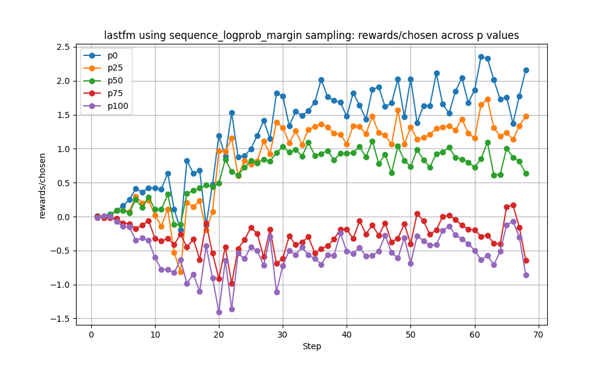
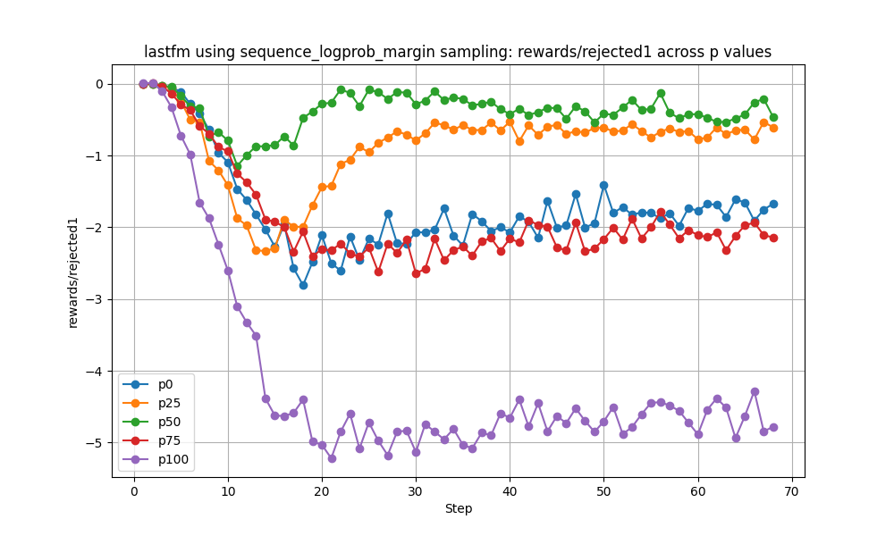
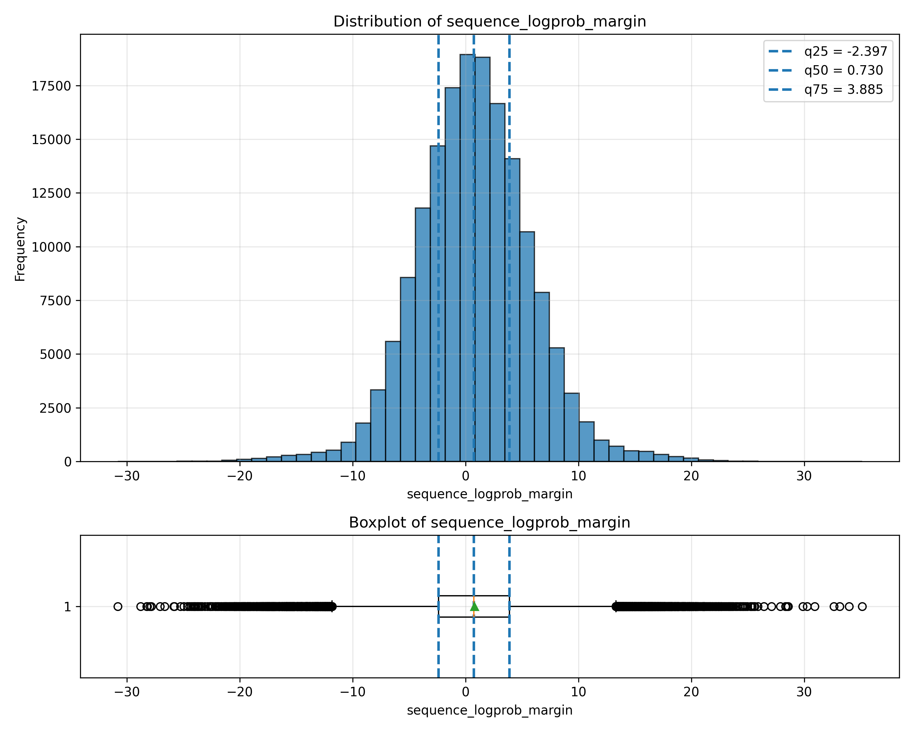
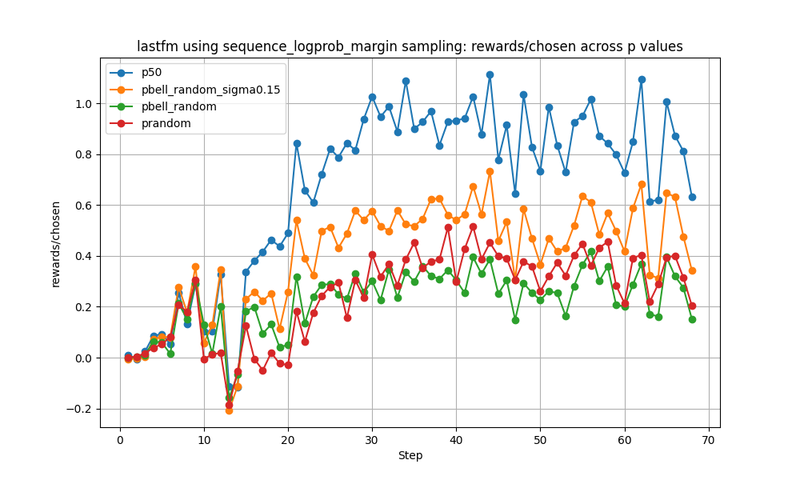
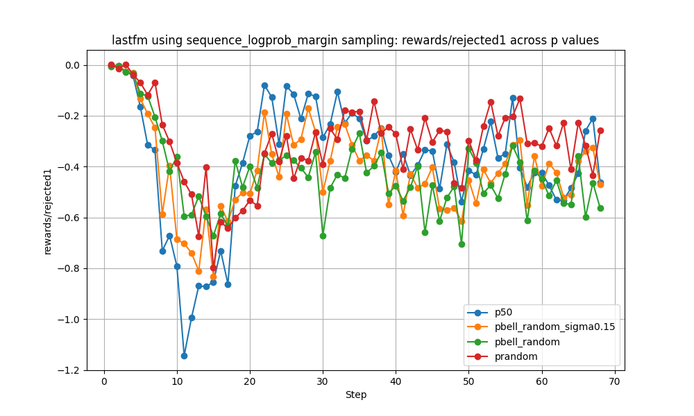
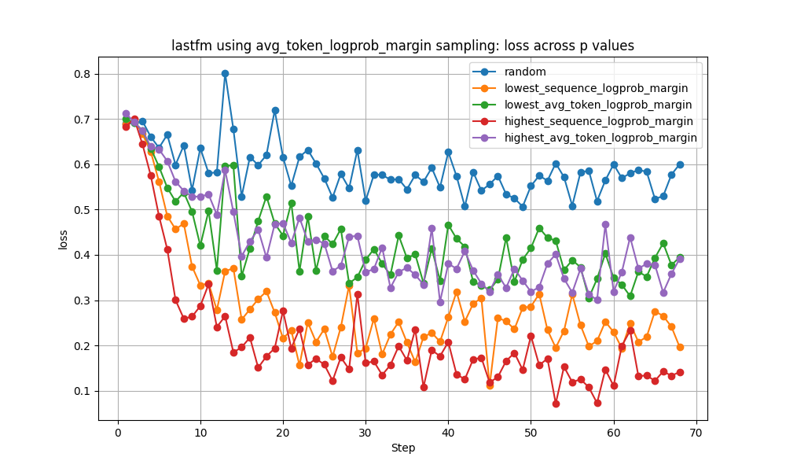
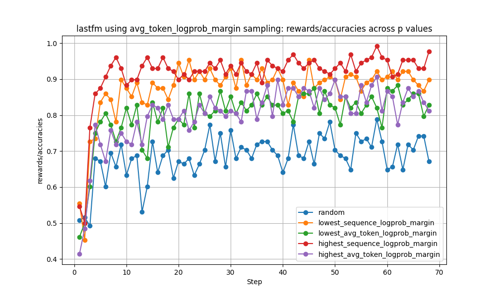
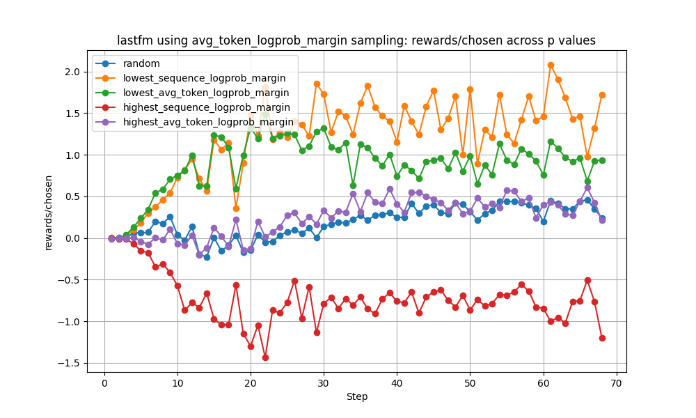
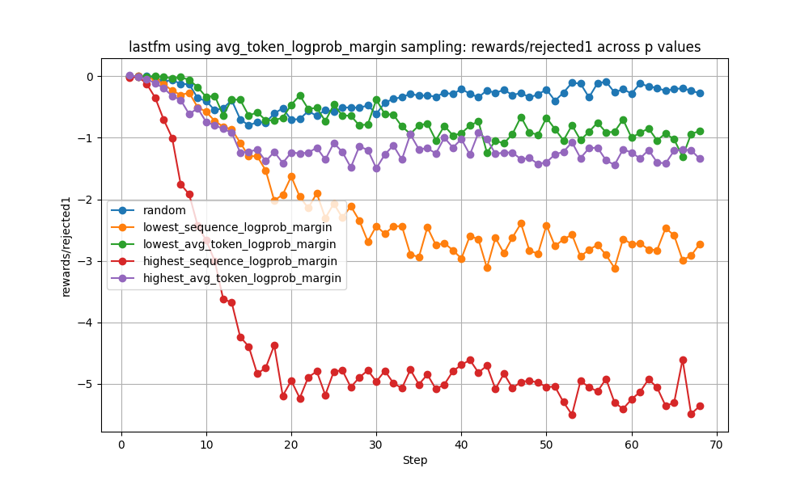
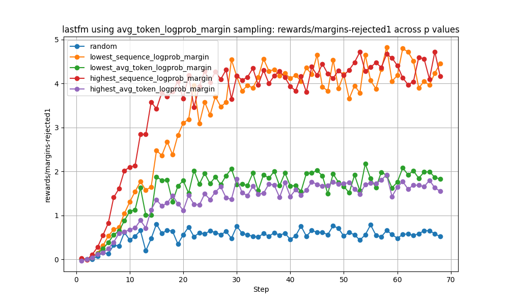

# Sequence logprob margin on sdpo_neg3
- epoch 1
- training sequence 200

- sequenc_logprob_margin
    - min:   -30.807267
    - q25:   -2.397336
    - q50:   0.729880
    - q75:   3.885110
    - max:   35.118398

- 根據[Towards Analyzing and Understanding the
Limitations of DPO: A Theoretical Perspective](https://arxiv.org/abs/2404.04626)，模型傾向更強力壓縮負樣本

- $x1 = \frac{π_θ(y_w|x)}{π_{ref} (y_w|x)}$
- $x2 = \frac{π_θ(y_l|x)}{π_{ref} (y_l|x)}$
- 分界：x2/x1 >1 更傾向提升正樣本，<1更傾向降低負樣本
- $\frac{​∂L}{​∂_{x_1}}​=−\frac{βx_1^β}{​x_1(x_1^β​+x_2^β​)}$
- $\frac{​∂L}{​∂_{x_2}}​=−\frac{βx_2^{β-1}}{​x_2(x_1^β​+x_2^β​)}$

## 中心點
- 正樣本上升程度
    - q0>q25>q50>q75>q100
- 負樣本下降程度
    - rejected1: p100 >>  p75>p0   >> p25>p50
    - rejected2: p100 >> p75 >> p0 >> p25>p50
    - rejected3: p100 >> p75 >> p0 >> p25>p50
    - logits/rejected-rejected1: p0 >> p25 > p50 > p75 > p100
    - logits/rejected-rejected2: p0 >> p25 > p50 > p75 > p100
    - logits/rejected-rejected3: p0 >> p25 > p50 > p75 ~ p100
    - logps/rejected-rejected1: p0 > p25 > p50 > p75 > p100
    - logps/rejected-rejected2: p0 > p25 > p50 > p75 > p100
    - logps/rejected-rejected3: p0 > p25 > p50 > p75 > p100

### 分析
- Gradient
    - q0>q25>q50>q75>q100
- x2/x1
    - rejected1-chosen: 
        - p50 >> p25~p75 >> p0~p100~0
    - rejected2-chosen: 
        - p50 >> p25~p75 >> p0~p100~0
    - rejected3-chosen: 
        - p50 >> p25~p75 >> p0~p100~0
    - p0, p100 的x2/x1 << 1 強更傾向降低負樣本

- p100: 更傾向降低負樣本
    - $π_{ref} (y_w|x) >> π_{ref} (y_l|x)$
        -> $π_{ref} (y_l|x)$ 本來就很小
        -> 稍微降一點就會讓x2/x1 << 1
        -> x2/x1 << 1 強更傾向降低負樣本
    - q100 reject下降最多，chosen提升最少
- p0: 
    <!-- - $π_{ref} (y_w|x) << π_{ref} (y_l|x)$ 
    - x2/x1  
    = $\frac{π_θ(y_l|x)}{π_{ref} (y_l|x)} \div \frac{π_θ(y_w|x)}{π_{ref} (y_w|x)}$   
     = $\frac{π_θ(y_l|x)}{π_θ(y_w|x)} \times \frac{π_{ref}(y_w|x)}{π_{ref} (y_l|x)}$   
        -> $\frac{π_{ref}(y_w|x)}{π_{ref} (y_l|x)} << 1$  
    -> 所以 -->
    - reward = $\beta log \frac{π_θ(y|x)}{π_{ref} (y|x)}$
    - gradient 大 -> 正樣本負樣本變動都大
    - 0-20 steps:
        - reward/rejected1: 0 -> -2
        - reward/chosen: 0 -> 1.0
        - x2: 1 -> 0.2
        - x1: 1 -> 3
        - logits/rejected1: 0.4 -> 0.37
        - logits/chosen: 0.4 -> 0.37
        - x2/x1: 1.0 -> 0
    - 20-68 steps:
        - reward/rejected1: -2 -> -2
        - reward/chosen: 1.0 -> 2.0
        - x2: 0.2 -> 0.4
        - x1: 3 -> 9
        - logits/rejected1: 0.37 -> 0.42
        - logits/chosen: 0.37 -> 0.42
        - x2/x1: 0 -> 0

- sequence_logprob_margin
    - highest
        - 0.2681362725450902 0.9807615230460922
    - q75
        - 0.27975951903807617 0.9791583166332666
    - middle
        - 0.2881763527054108 0.972745490981964
    - q25
        - 0.2905811623246493 0.9691382765531062
    - lowest
        - 0.2380761523046092 0.8416833667334669

## 集中度

- sequence_logprob_margin
    - middle
        - 0.2881763527054108 0.972745490981964

    - bell_random_sigma0.15
        - 0.29298597194388776 0.9711422845691383

    - bell_random
        - 0.29178356713426856 0.9751503006012024
        
- random
    - 0.29178356713426856 0.9743486973947896

- 正樣本上升程度
    - middle>bell_random_sigma0.15>bell_random~random
- 負樣本下降程度
    - 差不多

- 根據[Towards Analyzing and Understanding the
Limitations of DPO: A Theoretical Perspective](https://arxiv.org/abs/2404.04626)，模型傾向更強力壓縮負樣本

- $x1 = \frac{π_θ(y_w|x)}{π_{ref} (y_w|x)}$
- $x2 = \frac{π_θ(y_l|x)}{π_{ref} (y_l|x)}$

- 分界：x2/x1 >1 更傾向提升正樣本，<1更傾向降低負樣本

- sequenc_logprob_margin 大 $\rightarrow$ $π_{ref} (y_w|x) >> π_{ref} (y_l|x)$  
    - $\rightarrow$ 在同樣變動幅度下，$\frac{π_θ(y_w|x)}{π_{ref} (y_w|x)} >> \frac{π_θ(y_l|x)}{π_{ref} (y_l|x)}$
    - $\rightarrow$ $\frac{x_2}{x_1} << 1$ 
    - $\rightarrow$ 強力壓低負樣本, 正樣本略微下跌
- sequenc_logprob_margin 小 $\rightarrow$ $π_{ref} (y_w|x) \sim π_{ref} (y_l|x)$  
    - $\rightarrow$ 在同樣變動幅度下，$\frac{π_θ(y_w|x)}{π_{ref} (y_w|x)} \sim \frac{π_θ(y_l|x)}{π_{ref} (y_l|x)}$
    - $\rightarrow$ $\frac{x_2}{x_1} \sim 1$ 
    - $\rightarrow$ 提升正樣本

- add popularity(gini), bias metrics
- sdpo + 去掉lowest vs sdpo
- 2 step 
    - low margin -> high margin
    - low margin -> popularity base

- tamux sdpo_run
    - bash softmax_dpo_200seq.sh 0   
    - -------------- DPO Training Mode-----------                                               
        Reject select mode: random                                                                               
        logging_dir: ./logs/sdpo_neg3/random_lastfm_321B_200seq_1epoch/                                          
        output_dir: ./output/sdpo_neg3/random_lastfm_321B_200seq_1epoch/   
- tamux sdpo_run2
    - bash softmax_dpo_200seq_sort_all_percentage.sh 1 sequence
_logprob_margin                                            
    - ----------------- DPO Training Mode -----------------
        Reject select mode: lowest                                                                               
        Reject sort metric: sequence_logprob_margin                                                              
        logging_dir: ./logs/sdpo_neg3/sequence_logprob_margin_lowest_lastfm_321B_200seq_1epoch/
        output_dir: ./output/sdpo_neg3/sequence_logprob_margin_lowest_lastfm_321B_200seq_1epoch/
        -----------------------------------------------------                             
- tmux sdpo_run3
    - bash softmax_dpo_200seq_sort_all_percentage.sh 3 ln_ches_
score 3
    - ----------------- DPO Training Mode ----------------- 
        Reject select mode: lowest                                                                               
        Reject sort metric: ln_ches_score                                                                        
        logging_dir: ./logs/sdpo_neg3/ln_ches_score_lowest_lastfm_321B_200seq_3epoch/
        output_dir: ./output/sdpo_neg3/ln_ches_score_lowest_lastfm_321B_200seq_3epoch/
        -----------------------------------------------------
- tmux sdpo_run4
    - bash softmax_dpo_200seq_sort_all_percentage.sh 2 ches_sco
re
    - ----------------- DPO Training Mode ----------------- 
        Reject select mode: lowest                                                                               
        Reject sort metric: ches_score                                                                           
        logging_dir: ./logs/sdpo_neg3/ches_score_lowest_lastfm_321B_200seq_1epoch/                               
        output_dir: ./output/sdpo_neg3/ches_score_lowest_lastfm_321B_200seq_1epoch/
        -----------------------------------------------------

- [觀察]
    -  有可能是mix訊號更好？
    -  那可能比較 low margin -> high margin?
- 或是先試sdpo?

HitRatio@1, ValidRatio

before dpo
0.23246492985971945 0.9879759519038076

random
0.2913827655310621 0.9767535070140281

- avg_token_logprob_margin
    - highest
        - 0.2777555110220441 0.9819639278557114

    - lowest
        - 0.2837675350701403 0.9082164328657315

- sequence_logprob_margin
    - highest
        - 0.26973947895791583 0.9803607214428858

    - q75
        - 0.2725450901803607 0.9775551102204408

    - middle
        - 0.28617234468937874 0.9743486973947896

    - q25
        - 0.2881763527054108 0.9671342685370742

    - lowest
        - 0.16472945891783566 0.6056112224448897

    - random_except_lowest
        - 0.2889779559118236 0.9739478957915831
        
    - bell_random
        - 0.28777555110220443 0.9735470941883767s

- sequence prob margin using 200 seq on fullSFT model (sequence prob amrgin calculate using fullSFT)
    - highest
        - 0.4933867735470942 0.9927855711422846

    - q75
        - 0.49659318637274547 0.9931863727454909

    - middle
        - 0.5026052104208417 0.9923847695390782

    - q25
        - 0.5006012024048097 0.9947895791583167

    - lowest
        - 0.49579158316633265 0.9919839679358717

- ln_ches
    - highest
        - 0.28336673346693386 0.96312625250501

    - q75
        - 0.28577154308617236 0.974749498997996

    - middle
        - 0.2845691382765531 0.974749498997996

    - q25
        - 0.28777555110220443 0.9775551102204408

    - lowest
        - 0.27214428857715434 0.9763527054108216

## neg3 epoch 1
- [3] random
    - 0.29178356713426856 0.9743486973947896
    - chosen 0.25
    - reject1 -0.2
    - margins-reject1 0.8

- ln_ches
    - highest
        - 0.2925851703406814 0.9643286573146292
    - q75
        - 0.29378757515030063 0.9743486973947896
    - middle
        - 0.2913827655310621 0.9755511022044088
    - q25
        - 0.2889779559118236 0.9751503006012024
    - lowest
        - 0.2769539078156313 0.9759519038076152

- avg_token_logprob_margin
    - highest
        - 0.287374749498998 0.9831663326653307
    - q75
        - 0.29178356713426856 0.9779559118236473
    - middle
        - 0.2949899799599198 0.9735470941883767
    - q25
        - 0.2913827655310621 0.9723446893787575
    - lowest
        - 0.29458917835671344 0.9547094188376753
    

- sequence_logprob_margin
    - [7] highest
        - 0.2681362725450902 0.9807615230460922
        - chosen -0.5
        - reject1 -5
        - margins-reject1 4

    - [6] q75
        - 0.27975951903807617 0.9791583166332666
        - chosen -0.5
        - reject1 -2
        - margins-reject1 1.5

    - [5] middle
        - 0.2881763527054108 0.972745490981964
        - chosen 0.7
        - reject1 -0.5
        - margins-reject1 1

    - [4] q25
        - 0.2905811623246493 0.9691382765531062
        - chosen 1.5
        - accuracies 0.7
        - reject1 -0.5
        - margins-reject1 2

    - [8] lowest
        - 0.2380761523046092 0.8416833667334669
        - chosne 2.0
        - accuracies 0.81
        - reject1 -1.8
        - margins-reject1 4

    - [3] bell_random
        - 0.29178356713426856 0.9751503006012024
        - chosen 0.2
        - accuracies 0.45
        - reject1 -0.5
        - margins-reject1 0.8

    - [2] bell_random_sigma0.15
        - 0.29298597194388776 0.9711422845691383
        - chosen 0.35
        - accuracies 0.
        - reject1 -0.5
        - margins-reject1 0.9

    - [1] bell_q25_random
        - 0.29378757515030063 0.9615230460921844
        - chosen 0.9
        - accuracies 0.6
        - reject1 ~ 0
        - margins-reject1 1

    - [4] bell_q75_random
        - 0.2905811623246493 0.9791583166332666
        - chosen ~0
        - accuracies 0.6
        - reject1 -1 
        - margins-reject1 1

    - bell_q15_random
        - 0.29378757515030063 0.9571142284569139
    - bell_q05_random
        - 0.2933867735470942 0.9551102204408818
    - bell_q00_random
        - 0.2933867735470942 0.9619238476953907
    - tail_random_0.25
        - 0.29298597194388776 0.9575150300601203
    - tail_random_0.15
        - 0.29298597194388776 0.9575150300601203

- [3] random
    - 0.29178356713426856 0.9743486973947896
    - chosen 0.25
    - reject1 -0.2
    - margins-reject1 0.8

# sdpo_neg3_epoch3
- random
    - 0.3186372745490982 0.9703406813627254

- ln_ches_score
    - highest
        - 0.3022044088176353 0.96312625250501
    - q75
        - 0.3150300601202405 0.972745490981964
    - middle
        - 0.3114228456913828 0.974749498997996
    - q25
        - 0.2889779559118236 0.9751503006012024
    - lowest
        - 0.3026052104208417 0.9783567134268537
- sequence logprob
    - highest
        - 0.2769539078156313 0.983567134268537
    - q75
        - 0.3022044088176353 0.9763527054108216
    - middle
        - 0.3150300601202405 0.9719438877755511
    - q25
        - 0.3038076152304609 0.9591182364729459
    - lowest
        - 0.27655310621242485 0.8789579158316633
    - bell 0.25
        - 0.3226452905811623 0.969939879759519

## loss

- 可能原因
    - loss越低 HR越低 (不合理)
        - random ~ highest_avg_token_logprob_margin ~ lowest_avg_token_logprob_margin
        ~ highest_sequence_logprob_margin
        \>> lowest_sequence_logprob_margin
        - highest_sequence_logprob_margin比lowest_sequence_logprob_margin更低

## accuracies

- 可能原因
    - accuracies越高 HR越低 (不合理)
        - random ~ highest_avg_token_logprob_margin ~ lowest_avg_token_logprob_margin
        ~ highest_sequence_logprob_margin
        \>> lowest_sequence_logprob_margin
        - highest_sequence_logprob_margin比lowest_sequence_logprob_margin更高

## chosen

- 可能原因
    - chosen reward越偏離0 HR越低 (可能合理？)-
        - random ~ highest_avg_token_logprob_margin ~ lowest_avg_token_logprob_margin
        ~ highest_sequence_logprob_margin
        \>> lowest_sequence_logprob_margin
        - |lowest_sequence_logprob_margin| > 1.5 > others
    - chosen reward越震盪 HR越低 (可能合理？)-
        - random ~ highest_avg_token_logprob_margin ~ lowest_avg_token_logprob_margin
        ~ highest_sequence_logprob_margin
        \>> lowest_sequence_logprob_margin
        - lowest_sequence_logprob_margin 振蕩幅度 > others
            - 可能調低lr?

## reject

- 可能原因
    - reject reward越低 HR越低 (不合理)-
        - random ~ highest_avg_token_logprob_margin ~ lowest_avg_token_logprob_margin
        ~ highest_sequence_logprob_margin
        \>> lowest_sequence_logprob_margin
        - highest_sequence_logprob_margin比lowest_sequence_logprob_margin更低

## margin between chosen and reject reward

- 可能原因
    - margin between chosen and reject reward越高 HR越低 (不合理)-
        - random ~ highest_avg_token_logprob_margin ~ lowest_avg_token_logprob_margin
        ~ highest_sequence_logprob_margin
        \>> lowest_sequence_logprob_margin
        - highest_sequence_logprob_margin跟lowest_sequence_logprob_margin差不多
# 重構
before dpo
0.4961923847695391 0.9947895791583167

dpo neg1
0.5202404809619239 0.9911823647294589
- chosen 1.75
- reject1 -1.35
- margins-reject1 3.2

sdpo neg3
0.5338677354709419 0.9915831663326653
- chosen 1.9
- reject1 -1.3
- margins-reject1 3.25

sdpo_neg3 bell random 0.25
0.5246492985971943 0.9919839679358717
- chosen 1.75
- reject1 -1.5
- margins-reject1 3.25

在margin一樣的前提下，chosen提升越多越好
- chosen: sdpo neg3 [1.9] > sdpo_neg3_bell_random_0.25[1.75] = dpo[1.75]
- reject1: sdpo neg3 [-1.3] > dpo[-1.35] > sdpo_neg3_bell_random_0[-1.5]
- margins-reject1: sdpo neg3 = sdpo_neg3_bell_random_0.25[1.75] = dpo[1.75]

# 200 seq
count: 167048
mean:  0.787612
std:   5.052220
min:   -30.807267
q25:   -2.397336
q50:   0.729880
q75:   3.885110
max:   35.118398

## epoch3
- random
    - 0.3186372745490982 0.9703406813627254
- sequence logprob
    - highest
        - 0.2769539078156313 0.983567134268537
    - q75
        - 0.3022044088176353 0.9763527054108216
    - middle
        - 0.3150300601202405 0.9719438877755511
    - q25
        - 0.3038076152304609 0.9591182364729459
    - lowest
        - 0.27655310621242485 0.8789579158316633
    - bell 0.25
        - 0.3226452905811623 0.969939879759519

- chosen: p0 > p25 > p50~random~bell_random > p75~P100
- rejected1: random[-0.2] > bell_random[-0.5] > p50[-1] > p25[-1.2] > p0[-2.2] > p75[-2.5] > p100[-5.5]
- rejected2: random[-0.2] > bell_random[-0.5] > p50[-1] > p25[-1.2] > p0[-2] > p75[-3] > p100[-5]
- rejected3: random[-0.2] > bell_random[-0.5] > p50[-1] > p25[-1.2] > p0[-1.5] > p75[-3] > p100[-4]

- margins-rejected1: p100 > p0 > p25 ~ p75 > p50 > random ~ bell_random

- margin 相同
    - random chosen/reject都稍大，

## epoch 1
count: 167048
mean:  0.787612
std:   5.052220
min:   -30.807267
q25:   -2.397336
q50:   0.729880
q75:   3.885110
max:   35.118398

- [1] bell_q25_random
    - 0.29378757515030063 0.9615230460921844
    - chosen 0.9
    - accuracies 0.6
    - reject1 ~ 0
    - margins-reject1 1

- [3] bell_random
    - 0.29178356713426856 0.9751503006012024
    - chosen 0.2
    - accuracies 0.45
    - reject1 -0.5
    - margins-reject1 0.8
- [2] bell_random_sigma0.15
    - 0.29298597194388776 0.9711422845691383
    - chosen 0.35
    - accuracies 0.
    - reject1 -0.5
    - margins-reject1 0.9
- [3] random
    - 0.29178356713426856 0.9743486973947896
    - chosen 0.25
    - reject1 -0.2
    - margins-reject1 0.8

- chosen: bell_random_sigma0.15 [0.35] > random[0.25] > bell_random[0.2]
- reject1: random [-0.2] > bell_random_sigma0.15[-0.5] = bell_random[-0.5]
- margins-reject1: bell_random_sigma0.15 [0.9] > random[0.8] = bell_random[0.8]
- margin 相同
    - random跟bell_random比 chosen/reject都稍大

- chosen
    - [峰值]越集中在中間: chosen越高 middle > bell_random_0.15 > bell_random_0.25
    - [中心點]越小提升: chosen越高 p0>p25>p50>p75>p100
- reject
    - [峰值]越集中在中間: reject差不多 middle ~ bell_random_0.15 ~ bell_random_0.25
    - [中心點]
        - min:   -30.807267
            - gradient 大，reject下降多
        - q25:   -2.397336
        - q50:   0.729880
        - q75:   3.885110
        - max:   35.118398